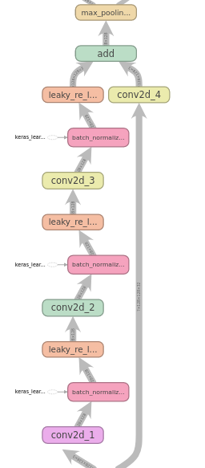
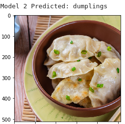

# DL Assignment 1
This repository contains the Deep Learning (DL) models developed as part of image classification task
assigned as part of the Deep Learning Assignment 1 at Ngee Ann Polytechnic.

# Report
The following report gives a detailed look at the DL work done in the Assignment.

Assignment 1 - Report

By Zhu Zhanyan

## Table of Contents

**[Table of Contents](#table-of-contents) 2**

**[Overview](#overview) 3**

**[Data Preprocessing and Data Loading](#_e5ouxc3osuvk) 3**

**[Develop the Image Classification Models](#_jnvsjurkogwg) 3**

**[Evaluate models using Test images](#_ifihebdwjevy) 3**

**[Use the Best Model to perform
classification](#use-the-best-model-to-perform-classification) 3**

## 1. Overview

*Describe the problem, the objective and the approach. (500-1000 words)*

**Abstract**

This report explores the problem of training a Deep Learning (DL) model
to recognise and classify 10 different types of foods sampled from the
Food-101 dataset to satisfactory level of accuracy. It also explores two
methods for developing and building DL models to solve the image
classification task, building a model from scratch and fine tuning a
pretrained model trained on a similar dataset to this task. Finally,
This report explores the techniques used during, training and tuning of
the DL models to evaluate and improve the models predictive performance.

**Problem**

The Food-101 dataset contains a collection of 1000 images for each of
its 101 food types, culminating in a total of 101,000 images of varying
dimensions. The Food-101 dataset stands out from older food-based
datasets by including food images from real-world environments sampled
from foodspotting.com. Older food-based datasets such as PFID-Dataset
contain images taken in laboratory conditions which may produce models
that are overly environment independent. Training images may contain
extreme color values and may include some mislabeled images \[1\].

The objective in this assignment is to build an image classification
model to classify 10-types of food. These 10 types of food are randomly
sampled from the 101 food types in the Food-101 dataset. The sampled
dataset is referred to as the “Assignment Dataset”. This sampling is
done by a provided notebook Image\_Preprocessing.ipynb based on a
preassigned set of categories given as a text file. The following food
types was assigned (50.txt):

strawberry\_shortcake

fried\_rice

french\_toast

fish\_and\_chips

dumplings

churros

chocolate\_cake

cheese\_plate

bibimbap

Beef\_carpaccio

**Assigned Image Categories**

**Samples from Assigned Categories**

The provided Image\_Preprocessing.ipynb notebook also splits the dataset
into a training, validation and test set with 7500, 2000 and 500 images
in each subset respectively. With a relatively small training set, the
DL models are prone to overfit to the training images. To combat this,
image augmentation could be applied to prevent the DL models from
quickly overfitting to the small training set.

**Images Distribution by Dataset Subset**

**Approach**

A high level overview of the approach used in solve this problem is as
follows:

1.  Apply exploratory data analysis to analyze dataset
    > characterististics. Here we inspect the dataset by checking for
    > problems such as class/label imbalance, inconsistent image sizes
    > between data examples.

2.  Use data preprocessing on a dataset to prepare the data to be used
    > by the model:

    -   Cropping is used to ensure that input image samples have the
        > same dimensions.

    -   Standard scaling is applied to the image features used to train
        > the model to normalize the image features to a normalized
        > scale.

    -   Image Augmentation techniques are added to combat the relatively
        > small training set size and introduce a regularization effect.

3.  Developing the From Scratch and Pretrained DL models:

    -   Parameterized model generation using function allows
        > hyperparameters to be selected and tuned from one place.

    -   Using BatchNormalization to accelerate model training.

    -   LeakyReLU to combat the vanishing gradient problem due to ReLU
        > dead zone &lt; 0

    -   Using Global Average Pooling to remove spatial dimensions and
        > prevent explosion in no. of weights.

    -   From Scratch: Using ResNET skip connections to train deep models
        > and prevent vanishing gradient problems.

4.  Training & Tuning the DL Models

    -   Using MLFlow to log model parameters, metrics, and other
        > metadata during training.

    -   Tuning the learning rate for faster model convergence.

    -   Ensuring that the model trains for a sufficient no. of epochs.

    -   Using Learning Rate Annealing to help models better converge
        > into minina at higher epochs.

    -   Using Adaptive Gradient Optimizer: Adam to speed up training.

    -   From Scratch Model: Selecting the no. of Convolutional
        > Blocks/Filter size to use.

    -   Pretrained Model: Freezing a fraction of layers allows layers
        > frozen to be a tunable hyperparameter.

5.  Evaluate trained models performance and conduct error analysis

    -   Evaluate trained models performance by evaluating the metrics on
        > the test set.

    -   Performing model selection on the test set.

6.  Using the best model to make predictions.

## 2. Data Preprocessing and Data Loading 

**EDA**

EDA is conducted on the Assignment Dataset and gathers more information
on the dataset. The dataset is first inspected for anomalies that should
be corrected before using the data to train the DL models. Finally,
Descriptive statistics are computed on the dataset features, giving
summary information on the dataset. A Pandas dataframe is constructed
containing the metadata of the images in the dataset, such as
class/label, image file path etc. This facilitates easier EDA on the
dataset as Pandas is an established Python Package for manipulating
columnar data, making it likely to integrate with other Python Packages
for visualization and EDA. One such package is Seaborn which allows the
data frame directly when plotting the graph, removing the need to add
additional data manipulation required to message the data for plotting.

**Samples by Class/Label**

**Seaborn Code used produce the Bar Graph**

**Checking for difference in class ratio due to Sampling Bias**

Since there are the same no. of images for every class, there is no
class imbalance in the Assignment Dataset. Hence class imbalance
corrections such as over sampling or undersampling are not required. A
quick check of the ratio of labels/classes in each train/validation/test
subset against the ratio computed on the entire Assignment Dataset shows
that the method used by the notebook to sample data into the
train/validation/test subset did not introduce any difference in
label/class ratio between the subsets and the full dataset due to
sampling bias. As such, we can be fairly confident that the sampled
dataset subsets are representative of the entire dataset.

**Image Sizes**

However the images in the dataset do not have consistent dimensions. All
together, there 221 different image sizes in the data, ranging from the
largest images at 512 by 512 to the smaller 512 by 222 images. Since DL
models discussed in this report include a fully connected/dense layer to
output predicted class probability, the input image provided to the
models has to be the same. A crop or resize operation is required to
ensure that the images provided to the model have the same dimensions.

**Descriptive Statistics computed on the Dataset**

Finally descriptive statistics such as minimum, maximum, mean standard
deviation on the dataset. This is done to provide summary information on
the dataset, such minimum and maximum pixel values of the images. Other
statistics such as mean and standard deviation computed to be used in
preprocessing methods such standard scaling. Computing descriptive
statistics on the dataset is difficult as the dataset does not fit in
the system’s RAM, causing Out Of Memory (OOM) errors if traditional
methods of computing such statistics are used (ie np.mean()). Instead,
Dask is used to compute the statistics across the dataset. Dask
partitions the dataset into more manageable chunks that can actually fit
into RAM and computates the statistics on those partitions. It then
aggregates the statistics computed on each partition to give the
statistic computed on the whole dataset, allowing statistics to be
computed on a dataset larger than RAM.

From the descriptive statistics, the images in the dataset have values
inputs in the range from 0 to 255. 0-255 is a relatively Feature large
range for DL models, which would compensate during training by training
a larger weight in order to cater to this large range. Larger weights
are harder and take longer to train, making training such DL models
tedious and difficult to train. Feature scaling would need to be done on
the images feature values to counter this by scaling the input features
fed to the DL models into a more manageable range.

**Loading Data**

-   Describe how you preprocess the data and load data into Jupyter
    > (300-500 words)

The Assignment Data prepared by the provided Image\_Preprocessing.ipynb
notebook is cached in Minio, a locally hosted S3 object storage service.
A custom image generator MinioImgGen is developed with the ability to
pull data images from the dataset from Minio. Dataset images are
retrieved from Minio using MinioClient and read using Pillow, a Python
Image library, into 3D numpy arrays. MinioImgGen is similar to Keras's
built-in ImageDataGenerator, implementing the same Sequence API. This
allows MinioImgGen to be transparently swapped where ImageDataGenerator
is typically used to provide training and evaluation data retrieved from
Minio when training a model with model.fit(). A MinioImgGen is
configured to load dataset images for each train/validation/test subset
of the Assignment Dataset.

**Preprocessing Data**

The image data prepared by MinioImgGen is preprocessed for DL model
consumption with Image Augmentation to increase training set size and
Standard Scaling to scale image pixel values to a smaller range. Since
our DL models contain fully connected/dense layers, we also need to
ensure that the prepared images fed the DL are of a consistent and
standardized size.

One useful feature of Keras’s ImageDataGenerator is the built-in, ready
to use Image Augmentation. Image Augmentation artificially increases the
amount of training data seen by the model, and provides regularizing
effect, making it useful to combat the Assignment Dataset’s small
training set size leading to proneness to the DL model overfitting. To
implement the image augmentation, MinioImgGen uses Alblumations to set
the image transforms used to augment image samples from the dataset,
such as random resizing and cropping, random rotations and brightness
adjustments. Additionally, gaussian noise and blurs are added to the
image to make sure that the DL model trained on these images is
resilient to these image distortions. Although Image augmentation is a
useful technique to expand the training set, special care has to be
taken to ensure that augmentation is not applied to the test set to get
consistent and accurate test and validation metrics.

**Image Augmentation transforms applied to Trainign Images**

Standard Scaling is performed by MinioImgGen to scale feature values to
the large 0-250 into a smaller range to combat the large feature ranges
resulting in harder to train DL models issue. Standard Scaling subtracts
the mean and divides by standard deviation, producing a smaller, more
manageable range of values. MinioImgGen performs standard scaling using
mean and standard deviation computed by Dask of the Assignment Dataset.

Finally, the preprocessing done in MinioImgGen has to ensure that
prepared images have identical dimensions. Dense/Fully Connected Layers
to be used in the DL Models only support a fixed size vector as input
from earlier layers. This translates to a fixed dimension constraint on
the input. From EDA done on the Assignment Dataset, we can observe that
the raw images come in various sizes. As such, the images have to be
resized into a fixed size. Instead of using the resize operation to
resize the dataset images which can distort the proportions of the
objects in the image, cropping is used to cut out a standardized sized,
undistorted piece of each dataset image. This is done during Image
Augmentation on the training set when making a random sized crop of the
image and on the test/validation using a deterministic centre crop of
the dataset image.

**Total Time spent in each Function**

Since this preprocessing is done once every data batch during training,
it is critical that it is performant as any performance overhead would
be incurred a couple hundred times every training epoch, and given the
hundreds of epochs required to fully train the DL models, this overhead
can quickly snowball into long and protracted model training times. By
profiling the code, we can observe that the function that implements
standard scaling processing spends several magnitudes larger total
execution time when fetching a batch of images from MinioImgGen. The
Numba Python Package provides a just-in-time (JIT) Python compiler that
converts a subset of Python Code into highly optimized machine code
\[5\]. By applying Numba JIT to compile the Standard Scaling
Preprocessing function into optimized machine code, the Total Time spent
in the function is cut in about half from 1.4 seconds to 0.57 seconds

**Total Time spent Preprocessing with/without Numba JIT**

## 

## 3. Develop the Image Classification Models

-   Describe how you build the models and train the models

This section discusses the DL model architectures developed and built to
solve the Assignment Task. One architecture, “From Scratch”, is
developed entirely from scratch while the other “Fine Tuned”
architecture splices pretrained layers obtained from another Model in
its architecture.

**From Scratch Model High Level Architecture**

**From Scratch Model**

The From Scratch model’s architecture is deeply inspired by the
architecture of the ResNET model described in “Deep Residual Learning
for Image Recognition” \[2\]. From a high level, the From Scratch model
is composed of a Input Convolution Layer, 4 ResNET-style Convolutional
Blocks with skip connections, a Global Average Pooling layer to remove
spatial dimensions from the Feature Maps, followed by a Dense Classifier
block configured to predict class/label.

The preprocessed image is first fed into a Input Convolution Layer with
a large 7 by 7 filter, which allows the convolution to capture more
contextual information using the filter’s larger receptive field over
the input image, followed by a max pooling that halves the size of the
feature map to aggressively half the spatial dimensions in order to
reduce computation cost of training and evaluating the DL model by
reducing the no.

of weights in the DL model.

**ResNET Convolution Block**

This is followed by multiple ResNET Convolution blocks which are
composed of 3 sets of 3 by 3 convolution, Batch Normalization and Leaky
ReLU layer and ResNET style skip connection. Ordinary Convolution layers
3 by 3 are added to extract spatial features in the input feature map
useful for later layers to build upon. Batch Normalization is added to
normalise the outputs after every convolution, which reduces the amount
of training required to adapt later layers to the changing outputs of
earlier layers during model training. This accelerates DL model training
and allows higher learning rates to be used when training \[3\]. This is
followed by a Leaky ReLU activation function, which introduces a
nonlinearity that allows the DL model to express complex functions with
multiple layers. Leaky ReLU is used instead of its more common cousin
ReLU as ReLU has a dead zone when the activation produced by layers is
equal or below zero. Since ReLU evaluates to 0 in this zone, the
gradient update computed by the optimizer would also be zero for the
rest of the training run. Leaky ReLU outputs a small value when
activation is below zero, ensuring that there always be at least a small
gradient update during training. \[4\] Finally, a ResNet style skip
connection is added to create a shortcut connection from the input of
the Convolution Block to the output. This combats the vanishing gradient
problem when training deep neural networks by creating a shortcut
connection where significant gradient updates can be computed. \[2\] A 1
by 1 Convolution layer is added on the skip connection to ensure that
shape of the output both via the skip connection and the convolution
layers align and can be added.

**Dense Classifier Block**

Finally a Dense Classifier Block is responsible for the last mile
mapping between the output Feature Maps of the Convolution layers to
predict class probabilities. Global Average Pooling is first applied to
remove spatial dimensions from the Feature Maps, converting the 3D
Feature Maps to 1D Feature Vectors so that they can be consumed by
Dense/Fully Connected Layers which only supports operating on 1D inputs.
Global Average Pooling is used instead of Flattening as it removes
spatial dimensions with the average entirely while Flattening only
merely squashes the spatial dimensions into 1D, which in turn provides
more total dimensionality reduction as compared to Flattening. This is
important because the Dense Layer will add an additional weight for each
element of the Feature Vector and Dense unit pair, which could result in
an explosion of weights between the Global Average Pooling and Dense
Layer. More weights means more training epochs would be required to
fully train the model while also making the model more prone to
overfitting. This is followed by a hidden Dense layer that allows it to
fit a more complex transformation between the 1D Feature Vector and
target prediction class probabilities. Finally a output Dense layer is
introduced to produce the expected output of probabilities of the input
image belonging to each class/label. Since there are 10 classes/labels
in the Assignment Dataset, we configure the output layer to include 10
Dense units, one for each of the 10 classes. To coerce the model to
output class probabilities instead of unbounded values, we apply the
softmax activation function on the output Dense layer. The softmax
activation extends the sigmoid activation functions to multiple classes,
coercing output values such that they sum up to 1, ensuring that output
values are valid class probabilities. Dropout layers are added between
Dense Layers to allow for regularization to be introduced in case of
overfitting.

**Fine Tuned Model Architecture**

The Fine Tuned Model shares the same Global Average Pooling and Dense
Classifier Block as the From Scratch model, but uses pre-trained
Convolutional layers from the NasNET mobile model in place of the From
Scratch Model’s Resnet-style Convolution Block to perform convolution.

The NasNET model is composed of NasNET cells which are Convolutional
blocks with an architecture selected via Reinforcement Learning (RL)
method. A “Controller” Recurrent Neural Network (RNN) is tasked with
proposing an architecture for the NasNET normal and reduction cells from
a fixed NasNET search space of convolutions. This controller RNN is
trained with RL to select the best cell architecture that maximizes the
model’s predictive performance. Normal cells perform convolution
maintaining the size of the feature map while reduction cells reduce the
spatial dimensions halves the size of the feature map. The NasNET model
is then built by stacking a series of these Normal and Reduction cells.
The pretrained layers sampled to build the Fine Tuned Model is from the
NasNET Mobile model, which is a smaller cousin of the NasNET model
designed to be lighter on computation resources \[6\]. To preserve the
pre-trained weights in the NasNET layers and prevent the overfitting, a
fraction of the layers is frozen before training.

**Training Curve (Accuracy) comparing Fine Tuned and From Scratch
Models**

The NasNET mobile model is pre-trained on the ImageNet dataset and since
both the Assignment Dataset and ImageNET dataset are Image
Classification tasks, the pre-training of NasNET layers on the ImageNET
layers should generalize to the Assignment Dataset’s task, thereby
reducing the amount of training required to train the Fine Tuned Model
that leverages the pre-trained layers. We can verify this during
training by comparing the training curves of the DL Models: the From
Scratch model takes about 300 epochs to train and converge. The Fine
Tune Model with pre-trained NasNET layers is able to exceed 90% training
accuracy with only 50 training epochs, finishing training and converging
at around 100 training epochs. This shows empirically that the Fine
Tuned Model is able to leverage the pre-training on ImageNet in the
Assignment Dataset task, training around 2-3 times faster as compared to
the From Scratch model.

## 4. Training & Tuning

-   Talk about both from scratch and pretrained model (1000-2000 words)

**Training & Tuning Process**

**The Training & Tuning Process**

The Training & Tuning Process implemented by train\_eval\_model() used
to train the DL models is as follows:

1.  The DL Model is built, compiled and trained for a given set of
    > hyperparameters such as learning rate, optimizer, no. of epochs to
    > train for etc on the training subset of the Assignment Dataset.
    > Training hyperparameters, metrics, model weights are recorded for
    > training run and are recorded to MLFlow for later analysis or use.

2.  The Trained DL Model is evaluated on the validation subset to
    > produce validation metrics which provide an estimate of the models
    > predictive performance and ability to generalize to unseen data.
    > These validation metrics are also committed to MLFlow for later
    > evaluation.

3.  Parameters and metrics from multiple training runs recorded in
    > MLFlow are visualized and evaluated to pick a new set of
    > hyperparameters to experiment and attempt to improve the model’s
    > predictive performance.

4.  Repeat steps 1-3 with a new set of hyperparameters.

**MLFlow**

**Logging Parameters to MLFlow**

MLFlow is an End to End Machine Learning (ML) platform that provides a
framework of tools to facilitate the development of ML models in the ML
lifecycle. MLFlow consists of multiple components that address different
problems in the ML lifecycle. In this Assignment, we will use only one
component: MLFlow Tracking to track hyperparameters and metrics for each
training run and store the trained model’s weights as an artifact for
later use. MLFlow provides a simple, easy to use API to record model
parameters, metrics and weights for each training. Additionally, MLFlow
tracks useful metadata about the training runs, such that if the
training run ran without errors and the total elapsed time it took to
complete training. This is then automatically uploaded to a central
MLFlow tracking server which provides a central repository for tracking
training runs in a structured manner. The parameters and metrics and
then be retrieved from the tracking server and converted into Pandas
dataframe for further analysis.

**MLFlow Tracking UI showing Training Runs sorted by Validation
Accuracy**

The Tracking Server provides an interactive UI that provides a listing
of all training runs at a glance, ability to filter or search for
training runs based on the parameters or metrics used or quickly sort
training runs by a metric such as by validation accuracy. The MLFLow
Tracking Server UI also makes it easy to quickly evaluate and compare
training runs. The UI allows quick access to metric plots, so a
training/validation accuracy curve is always a few clicks away. It also
allows the user to select multiple runs and compare. The UI would
display each of the selected models parameters and metrics side by side,
making it easy to infer what effect a change in a certain hyperparameter
has on the model’s metrics and thereby its predictive performance.
Making it easier to choose better hyperparameters for the next training
run.

**Comparing Multiple Runs in MLFlow Tracking UI**

**Tuning Hyperparameters: Learning Rate**

**Effect of LR on Training Curve**

The first order of business when tuning a DL model is tuning the
Learning Rate (LR). The LR is one of the more important hyperparameters
to tune as it affects the DL models ability to coverage during training.
If the LR is too high, the DL model may not be able to converge to an
optimal solution as the large gradient updates produced by the high LR
can cause the DL model to bounce around the optimal solution’s minima
instead of converging in it. In an extreme case where the learning rate
is extremely high, the DL model’s loss can increase and diverge, moving
in the opposite direction as intended. On the other end, the model might
take many training epochs and a long duration of time to train where the
LR is too low as the gradient updates created by the LR make tiny steps
to the minima. The LR for both From Scratch and Fine Tuned models are
tuned by running trials with LR values chosen on the logarithmic scale
such as 0.01, 0.001 or 0.0001 and analyzing its effects of trained DL
model’s validation accuracy. From this experimentation, the LRs 0.001
and 0.0001 are chosen for the From Scratch and Fine Tuned models
respectively.

**LR effects on Validation
Accuracy**

**Tuning Hyperparameters: No. of Training Epochs**

Another important hyperparameter to tune when training DL models is the
no. of epochs to train the DL model. Special care has to be taken to
ensure that the no. of training epochs is sufficient for the DL to fully
train and fully converge. Training for too little epochs and cutting off
training too early means that the metrics and weights gathered from
training may not be representative of the DL model’s full potential
fully trained. For example, conventional wisdom indicates that adding
more weights to a DL model should increase its ability to fit the
training set and should improve at least training metrics as compared to
the smaller DL model. If the training epochs are insufficient, the
larger DL model may appear to have worse or equivalent training metrics
to the smaller model. Only with a sufficient amount of training epochs
is this increase in weights reflected in the training metrics. The no.
of training epochs is tuned for both From Scratch and Fine Tuned models
by observing the training curve: If the training metrics are still
improving by the end of the training run, more training epochs are
required to train the model to its full potential.

**Effect of No. of Training(FIt) Epochs on Validation
Accuracy**

**Tuning Hyperparameters: LR Annealing**

LR annealing is the technique of reducing the LR during training to help
it to converge at closer to the end of the training. Due to the
relatively small batch size used during training, the gradient updates
estimated by the optimizer are less accurate due to the small sample
size, leading to the DL model bouncing around the minima towards the end
of training instead of converging. Reducing the LR towards the makes
these inaccuracies less damaging by reducing their impact on
convergence. There are various methods of scheduling the amount and rate
in which the LR is reduced during training such as by decaying LR every
constant no. of epochs, exponentially decaying the LR as training
progresses. Here we use Keras’s the ReduceLROnPlateau to schedule the LR
annealing, which monitors the training loss during training which halves
the LR if the loss does not improve in 10 training epochs. From
experimentation reducing the LR after 10 epochs by half allows the LR to
be reduced gradually, instead of suddenly causing training progress to
grind to an almost halt. LR Annealing improves the From Scratch model to
converge but gives a very slight and negligible benefit to the fine
tuned model. We can observe the effect of LR annealing in the training
curve of the From Scratch Model with the sudden jumps in training and
validation accuracy, and the reduced noise on validation accuracy
towards the end of training where LR annealing is active.

**Effect of LR Annealing on Validation Accuracy**

**Effect of LR Annealing on Training Curve**

**Tuning Hyperparameters: Optimizer  
**The optimizer is an algorithm in which gradient updates are computed
to train the DL models weights. In this assignment, we experimented with
using SGD with Momentum and Adam optimizers to train the models. SGD
with Momentum adds exponential moving average to SGD, making gradient
updates more stable and allowing the gradient updates to accelerate
towards the minima. Adam matains adaptive learning rates for each weight
in the DL model from moving averages of the gradient updates. From
experimentation we can observe that Adam is able to train the DL model
to certain accuracy faster than SGD with momentum although its not clear
if Adam or SGD with Momentum converges to the better final model. Adam
is used for both From Scratch and Fine Tuned Models

**Effect of Optimizer on Validation Accuracy**

**Tuning Hyperparameters: No. of Convolution Blocks/Size of Filters
(From Scratch only)  
**For the From Scratch Model, the No. of ResNET-style Convolution Blocks
to include in the model and the size of the Filters used in the
Convolution Layers of each ResNET-style Convolution Block have to be
tuned. From experimentation, increasing the, the No. of ResNET-style
Convolution Blocks from 3 to 4 provides a significant bump to validation
metrics while doubling the filter sizes of each Convolution Layer did
provide a negligible effect on the model’s predictive performance.

**Effect of Conv Blocks/Filter Size on Validation Accuracy**

**Tuning Hyperparameters: Fraction of Frozen Pretrained Layers (Fine
Tuned only)  
**For the Fine Tuned model, the Fraction of pre-trained NasNET layers
that should be frozen during training needs to be tuned. Freezing the
pre-trained layers allows the model to keep the weights pre-trained on
ImageNet intact, while reducing the no. of trainable parameters in the
DL model, thus reducing the models tendency to overfit to training set.
From experimentation, the lower fractions of pre-trained layers frozen
tended to correlate with higher final validation accuracy up to around
0.6 of the layers frozen

**Effect of Fraction of Frozen Pretrained Layers on Validation
Accuracy**

## 5. Evaluate Models using Test images

**Evaluating Models on Test Set**

The best variant of each model type: From Scratch and Fine Tuned model,
are selected by selecting the variant with the best Validation Accuracy.
The models are evaluated on the test set to obtain test metrics which
give unbiased estimates of the DL model’s predictive performance and
ability to generalize to unseen data. This is required as training and
validation metrics only gives a biased estimate of the model’s
predictive performance as the DL model has tuned its weights to the
training set and we have tuned the DL model’s hyperparameters to the
validation set. The evaluation of the best variant of each model type on
the test set is as follows:

| **Model Type**              | **Test Accuracy** | **Test Loss** |
|-----------------------------|-------------------|---------------|
| From Scratch (Best Variant) | 0.8750            | 0.4528        |
| Fine Tuned (Best Variant)   | 0.9000            | 0.4108        |

**Model Selection**

From the test metrics, we can select the Fine Tuned (Best Variant) model
as the best model to be used for prediction.

## 6. Use the Best Model to perform classification

**Online Image**

With the best model, we can use the model to predict the food type of
images out of the dataset. Here we use an image of dumplings obtained
online. The image must first be preprocessed in the same manner as test
and validation set images. The prepared image can then be fed into the
model for prediction using model.predict(), which returns a set of 10
class/label probabilities, which maps to the likelihood of the image
being of each food-type image. The predicted food type can be resolved
by finding the food type with the highest class predicted probability
which can be computed with np.argmax().

##  

## 7. Conclusion 

-   Summarize your model performance and provide suggestions for further
    > improvements (300-500 words)

**Summary of Performance of Best Model**

| **Model Type**            | **Training Accuracy** | **Training Loss** | **Validation Accuracy** | **Validation Loss** | **Test Accuracy** | **Test Loss** |
|---------------------------|-----------------------|-------------------|-------------------------|---------------------|-------------------|---------------|
| Fine Tuned (Best Variant) | 0.9836                | 0.0559            | 0.9057                  | 0.3771              | 0.9000            | 0.4108        |

**Further Improvements**

One way to improve the DL models trained in this Assignment is to
pretrain some layers of the model on the other Food Images Food-101
dataset. This expands the set of unique training images used to train
the model, making the DL model less prone to overfitting to the training
set. Expanding the training set is preferable to applying Image
Augmentation to artificially increase the training set as augmentation
relies on artificial transforms that may not be representative to what
is seen in the real world images. Another way is to use pre trained
layers in the Fine Tuned Model from another model trained on the
food-101 dataset. Since the model has seen the images in the Assignment
Dataset when training on the food-101, fine tuning the model to the
Assignment Dataset’s tasks should be easier and faster.

**References**

\[1\] Food-101 -- Mining Discriminative Components with Random Forests.
(2014, December 01). Retrieved from
[<u>https://data.vision.ee.ethz.ch/cvl/datasets\_extra/food-101</u>](https://data.vision.ee.ethz.ch/cvl/datasets_extra/food-101)

\[2\] He, K., Zhang, X., Ren, S., & Sun, J. (2015). Deep Residual
Learning for Image Recognition. arXiv, 1512.03385. Retrieved from
[<u>https://arxiv.org/abs/1512.03385v1</u>](https://arxiv.org/abs/1512.03385v1)

\[3\] An Intuitive Explanation of Why Batch Normalization Really Works
(Normalization in Deep Learning Part 1). (2019, March 15). Retrieved
from
[<u>https://mlexplained.com/2018/01/10/an-intuitive-explanation-of-why-batch-normalization-really-works-normalization-in-deep-learning-part-1</u>](https://mlexplained.com/2018/01/10/an-intuitive-explanation-of-why-batch-normalization-really-works-normalization-in-deep-learning-part-1)

\[4\]CS231n Convolutional Neural Networks for Visual Recognition. (2020,
September 22). Retrieved from
[<u>https://cs231n.github.io/neural-networks-1</u>](https://cs231n.github.io/neural-networks-1)

\[5\] Numba: A High Performance Python Compiler. (2020, August 15).
Retrieved from
[<u>https://numba.pydata.org</u>](https://numba.pydata.org)

\[6\] Zoph, B., Vasudevan, V., Shlens, J., & Le, Q. V. (2017). Learning
Transferable Architectures for Scalable Image Recognition. arXiv,
1707.07012. Retrieved from
[<u>https://arxiv.org/abs/1707.07012v4</u>](https://arxiv.org/abs/1707.07012v4)

\[7\] Introducing MLflow: an Open Source Platform for the Complete
Machine Learning Lifecycle. (2020, November 11). Retrieved from
https://databricks.com/blog/2018/06/05/introducing-mlflow-an-open-source-machine-learning-platform.html
